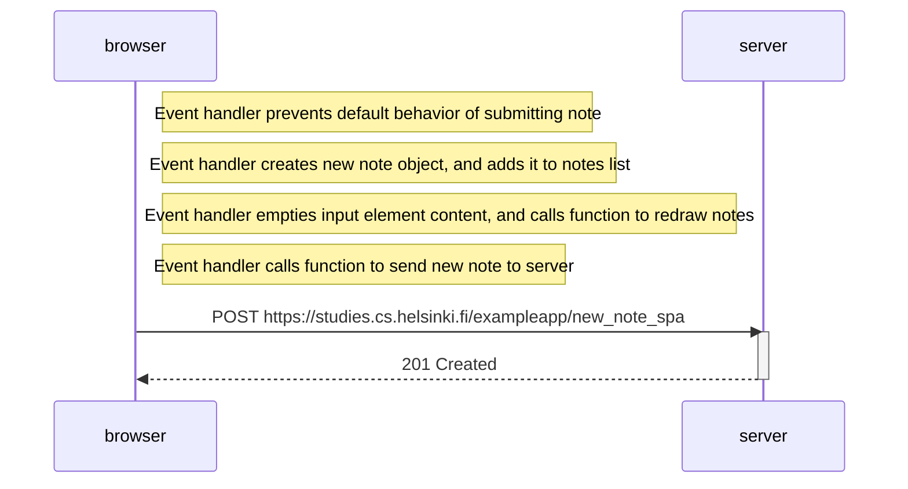

```mermaid 
sequenceDiagram
    participant browser
    participant server

    Note right of browser: Event handler prevents default behavior of submitting note

    Note right of browser: Event handler creates new note object, and adds it to notes list

    Note right of browser: Event handler empties input element content, and calls function to redraw notes

    Note right of browser: Event handler calls function to send new note to server

    browser->>server: POST https://studies.cs.helsinki.fi/exampleapp/new_note_spa
    activate server
    server-->>browser: 201 Created
    deactivate server
```
